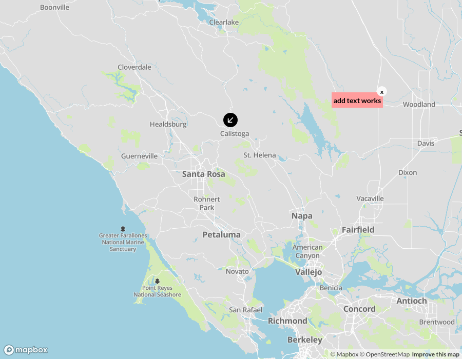

## Mapbox map creator

https://helpful-jelly-1d374a.netlify.app/

### Sample

<video height="350" src="./video.mp4"

### Todo/known issues 

* Improve the layers. The react-mapbox doesn't give access to setLayoutProperty, so I had to try a different way but it is not good.

* Add proper aria-labels

* Cancel add item. Let the user press Escape to cancel adding an item

* Add a central state using redux
